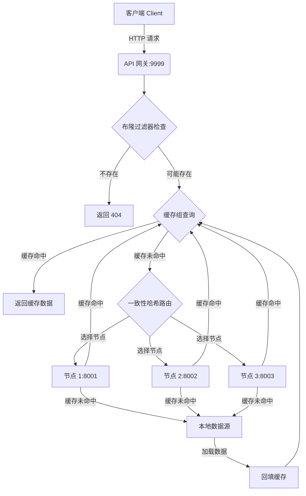
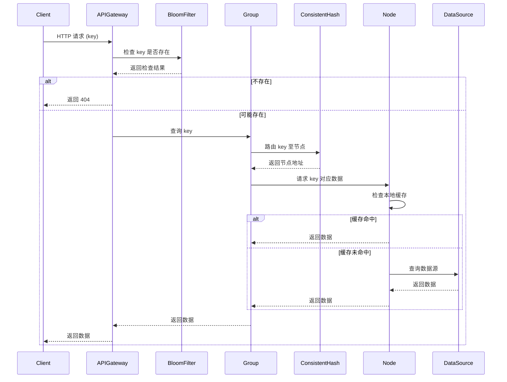

# 分布式缓存系统 (Distributed Cache System)

这是一个基于 Go 语言实现的分布式缓存系统，支持缓存节点自动发现、一致性哈希路由、缓存击穿与穿透防护等核心特性。系统采用模块化设计，结合多种高性能优化技术，确保在并发场景下的可靠性、扩展性与低延迟。

## 🎯 功能特性 (Features)

- **分布式架构**：支持多节点部署与自动集群节点发现
- **一致性哈希（Consistent Hashing）**：使用虚拟节点实现高效且均匀的请求分发
- **LRU 缓存淘汰**：自动淘汰最近最少使用的缓存项
- **缓存击穿防护（Cache Breakdown Prevention）**：通过 `singleflight` 机制防止重复加载同一资源
- **缓存穿透防护（Cache Penetration Prevention）**：集成布隆过滤器（Bloom Filter）拦截无效请求
- **RPC 通信**：基于 gRPC 框架，节点间使用高效的 Protocol Buffers 序列化协议
- **API 网关**：提供统一的 HTTP Restful 访问入口
- **并发安全**：所有核心组件实现线程安全，支持高并发访问
- **高性能设计**：融合零拷贝技术、连接复用、二进制协议等优化手段

## 📁 项目结构 (Project Structure)

```
.
├── run.sh                    # 启动测试脚本
├── main.go                   # 主程序入口
├── go.mod                    # Go模块定义
├── variables.env             # 环境变量配置文件
├── cache/                    # 核心缓存实现
│   ├── peers.go              # 节点选择接口
│   ├── rpc.go                # gRPC通信实现
│   ├── group.go              # 缓存组管理
│   ├── cache.go              # 缓存抽象层
│   ├── byteview.go           # 字节视图封装
│   ├── lru/                  # LRU缓存实现
│   ├── consistenthash/       # 一致性哈希实现
│   ├── singleflight/         # singleflight防击穿机制
│   └── cachepb/              # Protobuf定义
├── database/                 # 数据库模块
│   └── mysql/                # MySQL数据库连接
├── middlewares/              # 中间件
│   └── bloomfilter/          # 布隆过滤器实现
└── README.md                 # 项目文档
```

## 🚀 快速开始 (Quick Start)

### 环境要求 (Prerequisites)

- Go 1.24 或更高版本
- MySQL 5.7 或更高版本
- Git Bash（Windows 用户建议使用）

### 安装与运行步骤 (Installation & Run)

1. **克隆项目代码**
   ```bash
   git clone <repository-url>
   cd Cache
   ```

2. **配置环境变量**
   - 复制 `variables.env` 文件并编辑相关配置项：
   ```env
   DB_USER=your_username
   DB_PASSWORD=your_password
   DB_HOST=localhost
   DB_PORT=3306
   DB_NAME=itcast
   CACHE_PORT=8001            # 当前节点端口（可配置多个实例）
   API_GATEWAY_PORT=9999      # API 网关端口
   ```

3. **初始化数据库**
   ```bash
   # 启动 MySQL 服务后执行
   mysql -u root -p -e "CREATE DATABASE itcast;"
   ```

4. **启动缓存系统**
   ```bash
   # 为启动脚本添加执行权限
   chmod +x run.sh
   
   # 启动系统（默认同时启动多个节点与网关）
   ./run.sh
   ```
   如需手动启动指定节点：
   ```bash
   go run main.go -port=8001
   go run main.go -port=8002
   go run main.go -port=8003
   # 启动 API 网关
   go run main.go -gateway -port=9999
   ```

### 接口测试示例

```bash
curl "http://localhost:9999/api?key=Jack"
```

## 🔧 系统架构 (System Architecture)

### 系统流程图



### 请求处理时序图



## 📋 请求处理流程 (Request Processing Pipeline)

1. **客户端请求**：通过 HTTP API 发起请求，API 网关接收并处理
2. **布隆过滤器检查**：
   - 若键肯定不存在，直接返回 404，避免无效查询
   - 若键可能存在，进入缓存查询流程
3. **缓存组处理**：
   - 查询本地 LRU 缓存，若命中则直接返回
   - 若未命中，通过一致性哈希选择相应节点
4. **一致性哈希路由**：
   - 计算键的哈希值，映射至虚拟节点
   - 根据虚拟节点定位真实节点地址
5. **节点处理**：
   - 节点接收请求，查询自身缓存
   - 若命中则返回数据，若未命中则访问数据源
6. **数据源访问**：
   - 从 MySQL 数据库中加载数据
   - 将数据回填至节点本地缓存后再返回
7. **数据返回**：数据沿原路径返回至客户端

## 🧩 关键组件说明 (Core Components)

### 1. 缓存组 (Cache Group)

管理逻辑相关的缓存数据，提供统一的访问接口与加载逻辑：

```go
func (g *Group) Get(key string) (ByteView, error) {
    if value, ok := g.mainCache.Get(key); ok {
        log.Println("[Cache] hit")
        return value, nil
    }
    return g.load(key)
}
```

主要功能：
- 本地缓存优先访问
- 协调远程节点数据获取
- 数据源回填与缓存更新
- 集成 SingleFlight 防击穿机制

### 2. 一致性哈希 (Consistent Hashing)

实现请求到节点的分布式路由：

```go
func (m *Map) Get(key string) string {
    hash := int(m.hash([]byte(key)))
    idx := sort.Search(len(m.keys), func(i int) bool {
        return m.keys[i] >= hash
    })
    return m.hashMap[m.keys[idx % len(m.keys)]]
}
```

核心特性：
- 虚拟节点平衡节点负载
- 节点动态增删时最小化数据迁移
- 支持可配置的虚拟节点数量
- 时间复杂度为 O(log n)

### 3. 防击穿机制 (SingleFlight)

应对缓存失效时大量并发请求穿透至数据库：

```go
func (g *Group) Do(key string, fn func() (interface{}, error)) (interface{}, error) {
    g.mu.Lock()
    if g.m == nil {
        g.m = make(map[string]*call)
    }
    if c, ok := g.m[key]; ok {
        g.mu.Unlock()
        c.wg.Wait()
        return c.val, c.err
    }
    // ... 执行调用并返回
}
```

工作机制：
- 对同一键的并发请求合并为一次实际调用
- 后续请求阻塞等待首次调用的结果
- 自动处理超时与错误场景

### 4. 布隆过滤器 (Bloom Filter)

高效内存数据结构，用于检测键是否存在：

```go
func (bf *BloomFilter) Add(key string) {
    for _, seed := range bf.hashSeeds {
        val := bf.getHash(key, seed)
        bf.bitmap.Set(uint(val))
    }
}

func (bf *BloomFilter) Contains(key string) bool {
    for _, seed := range bf.hashSeeds {
        val := bf.getHash(key, seed)
        if !bf.bitmap.Get(uint(val)) {
            return false
        }
    }
    return true
}
```

优势：
- 内存占用极低
- 查询时间为常数 O(k)
- 可配置的误判率（False Positive Rate）

### 5. LRU 缓存淘汰策略

基于双向链表与哈希表实现高效的 LRU 缓存：

```go
func (c *Cache) Add(key string, value Value) {
    if ele, ok := c.cache[key]; ok {
        c.ll.MoveToFront(ele)
        ele.Value.(*entry).value = value
    } else {
        ele := c.ll.PushFront(&entry{key, value})
        c.cache[key] = ele
    }
    // ... 执行淘汰检查
}
```

特性：
- 读写操作时间复杂度为 O(1)
- 支持淘汰回调函数
- 线程安全访问

## ⚡ 性能优化 (Performance Optimization)

1. **字节零拷贝（Zero-Copy）**：通过 `ByteView` 封装减少数据复制
2. **高效序列化**：采用 Protocol Buffers 进行节点间数据编码
3. **连接复用**：支持 HTTP Keep-Alive 与 gRPC 连接池
4. **并行处理**：API 网关支持并发请求处理与响应
5. **内存优化**：布隆过滤器与 LRU 缓存高效管理内存使用
6. **高效路由**：一致性哈希实现快速节点查找

## 🧪 测试覆盖 (Testing)

执行以下命令运行完整测试套件：

```bash
go test -v ./...
```

测试范围包括：
- LRU 缓存功能与淘汰策略测试
- 一致性哈希算法与分布均匀性测试
- 缓存组集成与数据加载测试
- 防击穿机制并发测试
- 布隆过滤器误判率测试
- MySQL 数据源连接与查询测试

## 📊 性能基准测试 (Benchmarking)

运行性能基准测试：

```bash
go test -bench=. -benchmem ./...
```

系统设计目标：
- 平均响应时间： < 10ms
- 并发支持： > 1000 QPS
- 内存使用： 高效可控
- 网络开销： 低延迟，高吞吐

## 🔮 扩展计划 (Roadmap)

1. **缓存过期机制**：支持 TTL 与定期清理
2. **多存储后端**：扩展支持 Redis、Memcached 等存储
3. **监控与日志**：集成 Prometheus 指标与 ELK 日志收集
4. **动态节点管理**：支持热添加与删除节点
5. **传输安全**：支持 TLS 加密通信
6. **数据分片**：实现更大规模数据存储
7. **热点数据探测**：自动识别与复制高频访问数据
8. **多级缓存**：构建本地+分布式多级缓存架构

## 🐛 故障排除 (Troubleshooting)

### 常见问题 (Common Issues)

1. **数据库连接失败**
   - 确认 MySQL 服务正常运行
   - 检查 `variables.env` 中的连接参数是否正确
   - 验证数据库用户权限与网络连通性

2. **端口冲突**
   - 确保 8001、8002、8003 和 9999 端口未被占用
   - 可通过启动参数 `-port` 指定其他端口

3. **环境变量加载失败**
   - 确认 `variables.env` 文件存在且格式符合要求
   - 检查文件路径及读取权限

4. **gRPC 通信错误**
   - 确认所有节点正常启动且网络互通
   - 检查防火墙设置与安全组规则

### 调试模式 (Debug Mode)

启用详细日志输出协助诊断问题：

```bash
go build -o server main.go
./server -port=8001 -v=2
```

## 📄 许可证 (License)

本项目采用 Apache-2.0 开源许可证。

---

**注意**：本项目处于活跃开发阶段，部分功能与 API 可能会发生变化。