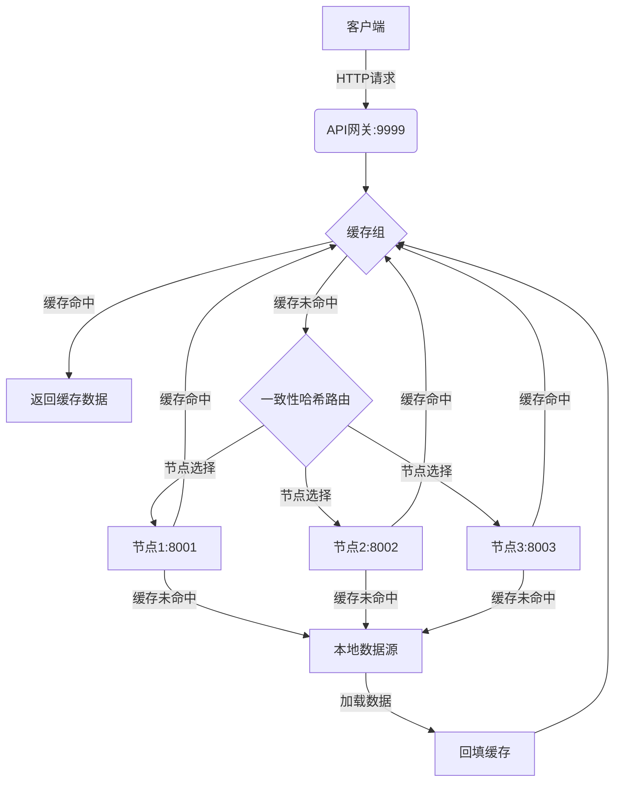

# 分布式缓存系统

这是一个基于Go语言实现的高性能分布式缓存系统，支持缓存节点发现、一致性哈希路由、防止缓存击穿等特性。

## 功能特性

- **分布式架构**：支持多节点部署，自动发现集群节点
- **一致性哈希**：使用虚拟节点实现高效且均匀的请求路由
- **LRU缓存淘汰**：自动淘汰最近最少使用的缓存项
- **缓存击穿防护**：通过`singleflight`机制防止重复加载相同资源
- **Protobuf通信**：节点间使用高效的`Protocol Buffers`二进制协议通信
- **API网关**：提供统一的HTTP访问入口
- **并发安全**：所有核心组件均实现线程安全

## 项目结构

```plaintext
.
├── run.sh                    # 启动测试脚本
├── main.go                   # 主程序入口
├── go.mod                    # Go模块定义
└── cache/                    # 核心缓存实现
    ├── peers.go              # 节点选择接口
    ├── http.go               # HTTP通信实现
    ├── group.go              # 缓存组管理
    ├── group_test.go         # 缓存组测试
    ├── cache.go              # 缓存抽象层
    ├── byteview.go           # 字节视图封装
    ├── lru/                  # LRU缓存实现
    │   ├── lru.go
    │   └── lru_test.go
    ├── consistenthash/       # 一致性哈希实现
    │   ├── consistenthash.go
    │   └── consistenthash_test.go
    ├── singleflight/         # singleflight防击穿机制
    │   └── singleflight.go
    └── cachepb/              # Protobuf定义
        ├── cache_pb.pb.go
        └── cache_pb.proto
```

## 快速开始

### 依赖安装

```bash
# 安装Go (1.24+)
```

### 编译运行

```bash
# 给予执行权限
chmod +x run.sh

# 启动系统
./run.sh
```

### 测试API

```bash
curl "http://localhost:9999/api?key=Tom"
```

## 系统流程图



## 请求处理流程

1. **客户端请求**：通过HTTP访问API网关（localhost:9999）
2. **API网关**：接收请求并转发到缓存组
3. **缓存组**：
   - 检查本地缓存（LRU）
   - 命中则直接返回数据
   - 未命中则进入路由流程
4. **一致性哈希路由**：
   - 计算请求键的哈希值
   - 选择最合适的节点（8001/8002/8003）
5. **节点处理**：
   - 检查本地缓存
   - 命中则返回数据
   - 未命中则访问本地数据源
6. **数据源访问**：
   - 从数据库加载数据
   - 回填到本地缓存
7. **数据返回**：
   - 通过节点返回给API网关
   - API网关返回给客户端

## 关键组件

### 1. 缓存组 (Group)

管理一组逻辑相关的缓存项，提供统一的访问接口：
- 本地缓存优先
- 远程节点获取
- 数据源回填

### 2. 一致性哈希 (ConsistentHash)

实现节点发现和请求路由：
- 虚拟节点平衡负载
- 节点变化时最小化数据迁移
- O(log n)时间复杂度的查找

### 3. 防击穿机制 (SingleFlight)

确保相同键的并发请求只执行一次：
```go
func (g *Group) Load(key string) (ByteView, error) {
    value, err := g.loader.Do(key, func() (any, error) {
        // 只有第一个请求会执行此函数
        if peer, ok := g.peers.PickPeer(key); ok {
            return g.GetFromPeer(peer, key)
        }
        return g.GetLocally(key)
    })
    // ...
}
```

### 4. LRU缓存

实现高效缓存淘汰策略：
- 双向链表快速移动元素
- 哈希表快速查找
- 可配置的淘汰回调

## 性能优化

1. **字节零拷贝**：使用`ByteView`避免数据复制
2. **ProtoBuf编码**：高效二进制序列化
3. **连接复用**：HTTP keep-alive保持连接
4. **并行请求**：API网关支持并发请求处理

## 测试用例

运行测试：
```bash
go test -v ./...
```

包含：
- LRU缓存功能测试
- 一致性哈希算法测试
- 缓存组集成测试
- 防击穿机制验证

## 扩展计划（To Do List)

1. 添加缓存过期机制
2. 实现持久化存储支持
3. 增加监控和日志系统
4. 支持动态节点添加/删除
5. 添加TLS安全传输
